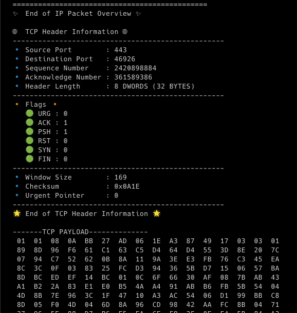

# Packet Sniffer

Welcome to Packet Sniffer, a powerful tool for capturing and analyzing network traffic. Whether you're a network administrator, developer, or security enthusiast, Packet Sniffer provides the essential features you need to understand and manage network communication.

## Features

- **Packet Capture:** Capture TCP, UDP, and other network packets.
- **Packet Details Display:** View detailed information about captured packets.
- **IP-Based Filtering:** Filter packets based on source and destination IP addresses.

### Installation

Clone the repository:

```bash
git clone https://github.com/your_username/packet-sniffer.git
```

Be root
```
sudo su
```

Compile the code
```bash
gcc -o packetSniffer ./main.c
```

Run the code
```bash
./packetSniffer
```

## Screenshots

### Displaying TCP packet thumbnail


### Displaying UDP Packet Thumbnail

### Displaying Other Packet Thumbnail

 

### Displaying TCP Packet Details 

 

### Displaying UDP Packet Details

 
